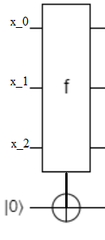
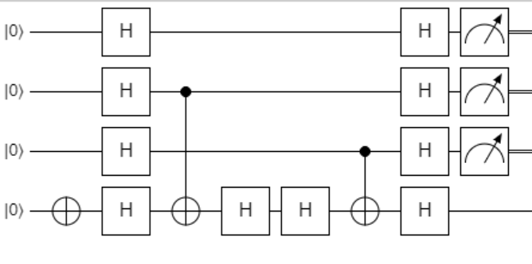

# Bernstein-Vazirani Algorithm

## Another toy problem

Much like the Deutsch-Jozsa problem, the Bernstein-Vazirani problem is a toy problem in which you are given a black box function that you want to learn about with
as few iterations as possible. Just like before, the black box function takes in $n$
bits of input and outputs a single bit:

```c#
public bool BlackBox(bit[] Input)
```

However, in this case instead of having a constant or balanced function, we know that the oracle function, $f$,
performs a bitwise dot product of the input bit string $x=x_0x_1...x_{n-1}$
with some fixed (albeit unknown) bit string $s=s_0s_1...s_{n-1}$.
That is
$$f(x)=(s_0x_0)\oplus (s_1x_1)\oplus...(s_{n-1}x_{n-1}).$$

The goal here is to find out the value of the mystery string, $s$,
with as few iterations of the function as possible. Classically, we know that we can figure out $s$
with $n$
iterations of the function. We can probe the function by inputing a string with the $i$
-th bit set to 1 and all other bits set to 0. Then the function will output the value of $s_i$.
Since we get one bit of information per iteration of the function, we can't figure out $s$
in less than $n$
iterations. Using a quantum algorithm, however, we can figure out $s$ in one iteration!

## Implementing the Oracle

If we were told to classically implement such a function, $f$,
and were given the string $s$,
how would we do it? To be more specific, we are given an input register consisting of $n$
bits initilized to the values of the bits of an input $x$
and an output register consting of one bit initialized to 0. The goal is for us to set the output bit to the value of $f(x)$. Essentially, this looks like

{: .center loading=lazy}

First, we could notice that if a bit of $s$,
$s_i$,
was zero than the value of $x_i$
has no impact on the output of $f$.
Thus, we can leave these bits in the register alone. On the other hand, if $s_i=1$,
then toggling $x_i$
between 0 and 1 flips the value of the resulting $f(x)$.
We can implement this by adding a CNOT gate for every non-zero bit, $s_i$,
which will have the $i$
-th bit in the input register as a control and the output bit as a target.

As an example, if $s=011$, then an implementation of $f$ would look like

{: .center loading=lazy}

This serves just fine as a quantum operation as well. Note that in the actual problem the oracle's mystery string is unknown. But we can rest assured that it behaves *equivilantely* to a circuit with a bunch of CNOT gates with certain input bits as controls and the output bit as the target. Our goal then is to find out which input bits control a CNOT gate and which ones don't.

## Phase kickback (again)

The quantum algorithm that solves this problem is pretty similar to the one that solves the Deutsch-Jozsa problem: flip the output bit to the 1 state, apply $H$
gates to all qubits (this time including the output qubit), apply the oracle, apply the $H$ gates again, and finally measure the qubits. This algorithm helps demonstrate an interesting way of interpreting phase kickback: **phase kickback swaps the control and target of CNOT gates**.

Indeed, if we could somehow flip all the CNOT gates in the earlier diagram upside down, then an output qubit in the 1 state would set all the CNOT gates off so that an input register initialized to $x=00...0$
would become the mystery string $s$.
To understand how phase kickback does this we first have to verify that the following matrices are equal: $HXH$
and $Z$.
Of cource, we can just do the multiplication of the 2-by-2 matrices to see this directly. However, we could also prove that $HXH=Z$
by showing that the two quantum operations have the same effect on basis states $\ket{0}$
and $\ket{1}$.
If we first apply an $H$
gate to the two states, we get a $\ket{+}$
and $\ket{-}$
state. Applying an $X$
to both states yields $\ket{+}$
and $-\ket{-}$. 
Finally, applying another $H$
yields $\ket{0}$
and $-\ket{1}$,
the same effect as just applying the phase gate $Z$.
This also shows that a CNOT gate with Hadamard gates around the target has equivilant behaviour to a CZ gate:

{: .center loading=lazy}

is equivilant to

{: .center loading=lazy}

This is because if the control bit is 1, then an $HXH=Z$
gate is applied to the target, while if the control bit is 0, then an $HH=I$
gate is applied instead.

Recall, from the [controlled gates section](https://stem.mitre.org/quantum/quantum-concepts/multi-qubit-gates.html#controlled-gates-in-general) that the target and control of a CZ gate are interchangeable. Thus, if the output bit is set to 1 before encountering the Hadamard gates of our circuit it will set of the CZ gates. These will act on the input register bits corresponding to non-zero $s_i$.
Since Hadamard gates where applied to all the input register qubits, they will all be in the $\ket{+}$
state. Those qubits corresponding to $s_i=0$
will remain unaffected (there is no controlled gate connecting them to the output qubit), while the qubits correspodning to $s_i=1$
will be targeted by an "effective" CZ gate which will make change them to the $\ket{-}$
state. 

Finally, another round of Hadamard gates will turn the $\ket{+}$
states in the input register into $\ket{0}$
and will turn the $\ket{-}$
states in the input register into $\ket{1}$.
Thus, at the time of measurement the input register has the value of $s$
encoded in its qubits and measuring it reveals $s$.

Applying this to our example with $s=011$,
we are attempting to run the quantum circuit diagram

{: .center loading=lazy}

which is equivilant to

{: .center loading=lazy}

since $H^2=I$.
This is then equivilant to

{: .center loading=lazy}

since $HXH=Z$.
Then using the interchangibility of control and target of the $Z$ gate

{: .center loading=lazy}

which is finally equivilant to

{: .center loading=lazy}

since $HZH=X$
(prove this for yourself as an exercise) and $H^2=I$. Understanding why the above algorithm works uses something called a **quantum circuit diagram equivilance argument**. This sometimes a great tool to get around having to keep track of states in a complicated superposition with many amplitudes. We summarize the algorithm as follows.

## Implementation

1. Apply X to the output qubit, so it is in the $\ket{1}$ state.
2. Apply H to all of the qubits (including output).
3. Run the oracle on the input register and output qubit (the oracle should perform a CNOT on the output).
4. Apply H to all of the qubits.
5. Measure all of the input qubits to find $s$.

