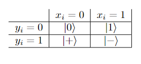

# Applications of Qubits outside of Algorithms

Before we talk about designing algorithms using qubits and quantum gates, we can look at a couple of applications of qubits themselves.
For one, there are infinite possible values for the amplitudes of the $\ket{0}$
and $\ket{1}$
states of a qubit, so we can try to pack more data into a qubit. Not that since measurement only yields a 0 or 1, we can't extract more than one bit of data. But this
one bit could still answer some kind of yes-or-no question about the data that was packed into the qubit. Let's consider the following problem

## Aaronson-Drucker Coin Problem

Suppose you are given a coin that is either fair (the probability of getting heads is 0.5) or biased towards heads by a known amount (the probability of
getting heads is $0.5+\theta$
for some known $\theta>0$). Can you determine if you have the fair coin or not? 

The only way you can figure this out is by repeatedly flipping the coin and keeping track of the number of heads and tails. Stastics tells us that we would have to
flip the coin an order of $\frac{1}{\theta^2}$
times to reliably figure out if there is a bias. This would require $\text{log}(1/\theta^2)$
bits of storage to keep track of the numbers of heads and tails. Instead, you could keep track of this count with a single qubit.

We will need two arbitrary rotation gates, $R_x(\theta)$
and $R_x(-\theta)$,
which perform a counterclockwise (resepectively clockwise) rotation by angle $\theta$
in the palm-plex plain. The procedure is as follows:

1. Initilize the qubit to $\ket{0}$
2. Flip the coin. If it comes up heads, apply $R_x(\theta)$,
   and if it come up tails, apply $R_x(-\theta)$.
3. Repeat step two $\lfloor \pi/(4\theta^2)\rfloor$
  times. (we'll get to the reason for this later)
4. Measure the qubit

If the coin was fair, then we expect their to be roughly the same number of clockwise and counterclockwise rotation, so that the final state of the qubit
is pretty close to $\ket{0}$.
Thus, we expect to measure a 0. If on the other hand, the coin was biased, then at any given flip the probability of counterclockwise rotation is $0.5+\theta$
and the probability of clockwishe rotation is $0.5-\theta$.
Thus, we expect a counterclockwise rotation by angle
$$\left(\frac{1}{2}+\theta\right)(\theta)+\left(\frac{1}{2}-\theta\right)(-\theta)=2\theta^2.$$
Thus performing roughly $\frac{\pi}{4\theta^2}$
coins flips achieves an expected rotation of $\frac{\pi}{4\theta^2}\cdot2\theta^2=\frac{\pi}{2}$.
Thus, for a biased the probability of measuring the qubit as being in the $\ket{1}$
state is quite high. 

We see here how we can load a bunch of data (the outcomes of all the flips) into a qubit and measuring it can tell us something about that data.

## Elitzur-Vaidman bomb

If you thought the premise of the coin problem was a little far-fetched, just wait till you hear about the Elitzur-Vaidman bomb tester. Suppose you
work for the Quantum Bomb Squad and recieve a suspicious package at the office. The package has peepholes at opposite ends through which a qubit can be sent (perhaps a photonic qubit). It also has a  note saying that the box is either empty of contains a bomb. The note also says the potential bomb would have a measurement device set up behind the peephole, which will detonate the bomb if it measures a 1 from a qubit coming in through the peephole (if it
measures a 0 it will just let the qubit pass all the way through out the other peephole). You're goal is to detect if there is a bomb or not while minimizing the chances of settign it off.

You have with you a qubit initialized to $\ket{0}$
and a rotation gate, $R_x(\theta)$.
Applying the gate to $\ket{0}$
yields
$$R_x(\theta)\ket{0}=\cos(\theta)\ket{0}+\sin(\theta)\ket{1}.$$
If $\theta$ is a small angle than the probability of setting off the bomb with this qubit is the probability of measuring $\ket{1}$:
$$|\sin(\theta)|^2\approx \theta^2.$$
Now, hoping you weren't exteremely unluck and detonated the bomb, keep applying $R_x(\theta)$ to the qubit and passing it through the device. If the bomb
was really there, then it would be measuring the qubit each time and (very likely) collapsing it back to $\ket{0}$
state. Thus, after roughly $\frac{\pi}{2\theta}$
trials the qubit would still be $\ket{0}$
assuming the bomb never measured a $\ket{1}$. 
Using more physics estimation tricks, we can roughly calculate the proability that the bomb doesn't detonate:
$$(1-\theta^2)^{\pi/(2\theta)}\approx 1-\frac{\pi}{2\theta}\theta^2=1-\frac{\pi}{2}\theta,$$
which can be made as close to 1 as you want as long as you are willing to decrease $\theta$
perform more trials.

On the other hand, if there was a never bomb then the qubit what pass through unaffected each time and you would have applied roughly $\pi/(2\theta)$
rotations by angle $\theta$
which would put the qubit in $\ket{1}$
state. To summarize the procedure:

1. Initialize the qubit to $\ket{0}$.
2. Apply  $R_x(\theta)$
   to the qubit and pass it through the box.
3. Repeat the previous step $\lfloor \pi/(2\theta)\rfloor$
   times
4. Measure the qubit. If you get 0, then there is a bomb. If you get a 1, then there is no bomb.

The process that occured is related to something called the **Quantum Zeno** or **Watched Pot Effect**. Essentially, when there is no person or device to measure a qubit it can slowly drift to change its state to something new. On the other hand, if something is constantly measuring the qubit, it has a smaller probability
of changing state from the one it was initialized to.

## BB84 Scheme

### One-time pad encryption
In addition to [superdense coding](https://stem.mitre.org/quantum/quantum-algorithms/superdense-coding.html), there is another quantum methadology for secure
communication between two parties, Alice and Bob, that avoids nasty eavesdropper Eve. First, we introduce the idea of **one-time pad encryption**. Suppose Alice wants to send bomb a secrete message which she stored in the binary bit string $m=m_0m_1...m_{n-1}$.
She is afraid that Eve might eavesdrop on this message and so she wants to encrypt it. Luckily, Alice and Bob share a secret key, a bit string $s=s_0s_1...s_{n-1}$.
Alice encrypts her message by taking the bitwise XOR of the two strings to create a string $e$ with entries
$$e_i=m_i\oplus s_i.$$
So for example, if $m=011$ 
and $s=101$,
then the encrypted string is $e=110$.

Alice sends $e$ to Bob and he decrpyts it by taking the bitwise XOR of $e$
and $s$
, so that the $i$-
th entry is
$$e_i\oplus s_i=(m_i\oplus s_i)\oplus s_i=m_i,$$
since $s_i\oplus s_i=0$.
Thus, even if Eve intercepts the string, $e$,
she can't decypher what it means without knowledge of $s$.
The reason it is called one-time pad encrytion is because the secrete key, $s$
should really be only used once, since otherwise Even can use cryptographic techniques
on the many encrypted messages she intercepts to begin and decypher the values of $s$.

### Quantum Key Distribution

The only problem now is to figure out a way to distribute the secret key to Alice and Bob, while being sure that Eve doesn't also find the key. Alice proposes the
following solution. She generates two random $n$-
bit strings, $x$ and $y$.
She creates an $n$-
qubit state initilized to state $\ket{x}$.
She then alters each qubit with in following way: if $y_i=1$ apply an $H$ gate to qubit $i$.

The following table summarizes what the $i$-
th qubit looks depending on $x_i,y_i$:

{: .center loading=lazy }

Alice then sends the resulting state to Bob. Bob generates a random $n$-
bit string $z$
and modifies the state he recieved as follows: if $z_i=1$, Bob applies an $H$ gate to qubit $i$.
Bob then measures the state to get a string of bits, $t$.
   
Now that the key has been sent, Alice and Bob share (through a classical communication channel) the strings $y$ and $z$,
which should agree in roughly $n/2$
places. Alice discards the bits of her string, $x$, corresponding to the entries where $y$ and $z$ disagree.
Bob does the same with his string, $t$. What remains is there shared private key.
   
As an example let $x=0101$,
$y=1100$,
and
$z=0101$.
Then Alice aplies Hadamard gates to the first two qubits of $\ket{1101}$
resulting in the state 
$$\ket{+}\otimes\ket{-}\otimes\ket{00}=\ket{+-01}.$$
This state is sent to Bob, who uses $z$
to determine that a Hadamard gate will be applied to qubits 1 and 3, resulting in state $\ket{+10-}$.
Measuring the state might yield different results for $t$ but it will always have the middle two qubits measuring to $\ket{10}$.
Since $y$ and $z$
agree in the middle two bits, Alice and Bob end up keeping the middle parts of $x$ and $t$:
10 

This is the secret key that they now both possess. To see why this works more precisely, if $y_i=z_i$
then either two (if $y_i=z_i=1$)
or zero (if $y_i=z_i=0$) 
Hadamard gates are applied to qubit $\ket{x_i}$
and since $H^2=I$, 
the net result is that the qubit stays in the state $\ket{x_i}$.
Bob then measures and keeps this bit as a member of the shared secret key.

### Eve attacks
Now, we have to get to the important part: what happens if Eve intercepts either the quantum state or the classically communicated strings $z$, $y$.
If Eve doesn't intercept the quantum state but intercepts the strings $z$, $y$,
she'll know which bits of the $x$ and $t$
are kept for the shared secret key, but she won't know what the values of those bits are. Thus, if she plans to decypher the secret key, she will need to intercept
the quantum state. 

But when the quantum state is sent, only Alice knows which bits are in $\ket{0},\ket{1}$
states and which bits are in the $\ket{+},\ket{-}$
states (since this is determined by $y$).
If Eve just naively measure the qubits of the state, all the qubits in the $\ket{+},\ket{-}$
states would collapse to $\ket{0}$
or $\ket{1}$,
changing the quantum state.
If Eve somehow knew the entries of $y$,
she could be slick and preserve the delicate states, $\ket{+},\ket{-}$.
Eve could apply an $H$
gate to remove the superpostion, measure the qubit (which will remain unaltered since it is now either $\ket{0}$
or $\ket{1}$),
and reapply the $H$ gate to restore the original state. This would allow her to uncover $x$ and thus the secret key lying in the subset of its bits.
However, she doesn't know $y$ and so we expect her to alter roughly half the qubits of the state, no matter what she tries.

Upon comparing $y$ and $z$,
Alice and Bob decide to check if they were eavesdropped by sacrificing a bit of their shared key $s$.
Indeed, if noone intervened, the shared keys would be identical and so comparing some of the bits of the keys would yield the same values
(even though classically shared values cant be used later on). Eavesdropping alters half the qubits of the transmitted state and there is still a $0.5$ 
chance that the value Bob measures for the comporised qubit just so happens to agree with Alices choice of $x_i$.
Thus, if $a$ bits of Alice and Bob's secret keys are sacraficed, then the chance of finding an eavesdropper-induced discrepancy is
$$1-(1-0.5^2)^a=1-\left(\frac{3}{4}\right)^a,$$
which can be made arbitrarliy close to 1 as $a$ (and $n$)
get large. Thus, if the sacrificed bits agree, Alice and Bob can be almost certain that they weren't eavesdropped. If they found out that they were eavesdropped,
then they can just repeat the BB84 scheme again.

### BB84 Scheme Summary

To summarize the steps of the scheme between sender Alice and reciever Bob:

1. Alice randomly generates two $n$-bit strings, $x$, $y$.
2. Alice initializes a quantum state to $\ket{x}$
3. Whenever, $y_i=1$, Alice applies an $H$ gate to qubit $i$
4. Alice sends the resulting state to Bob
5. Bob randomly generates an $n$-bit string $z$, and whenever $z_i=1$, Bob applies an $H$ gate to qubit $i$. Bob then measures the state and stores the value as $t$
6. Alice and Bob share strings $y,z$ and whenever $y_i\neq z_i$, Alice and Bob throw away bits $x_i,t_i$. The remaining strings are $x',t'$
7. Alice and Bob share some of the bits of $x',t'$. If they these bits agree, then the unshared bits of $x',t'$ are probably equal/not eavesdropped and can serve as the shared private key.
8. If the shared bits disagree somewhere, then Alice and Bob were eavesdropped

Unlike the Aarronson-Drucker Coin Problem and Elitzur-Vaidman Bomb, the BB84 scheme actually has potential applications as a secure key distribution scheme. Of course, the limiting factor is being able to reliably send a quantum state between two parties without the state decohering.
