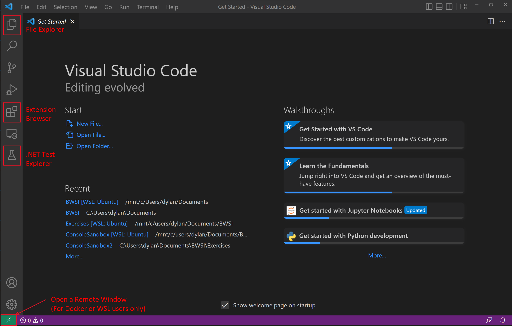
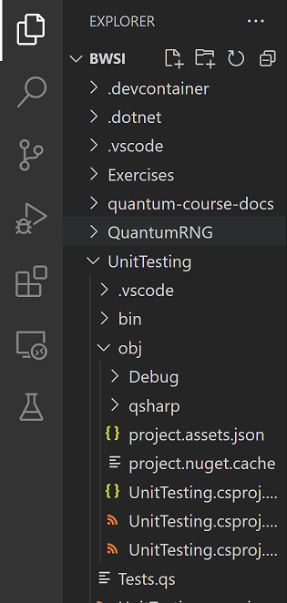
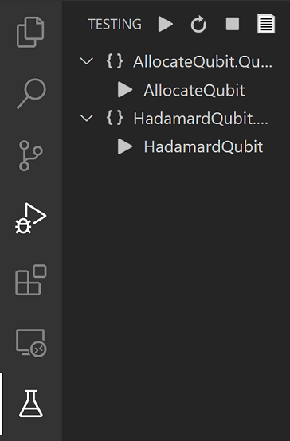
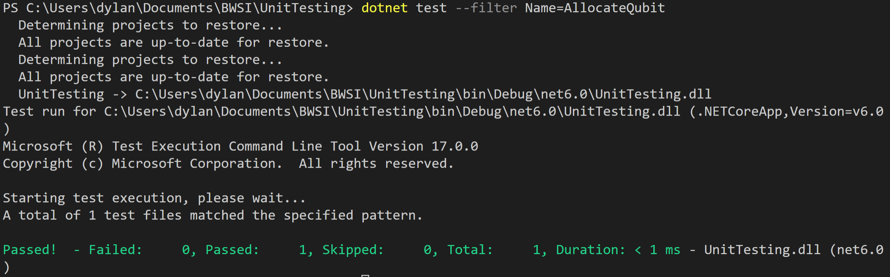
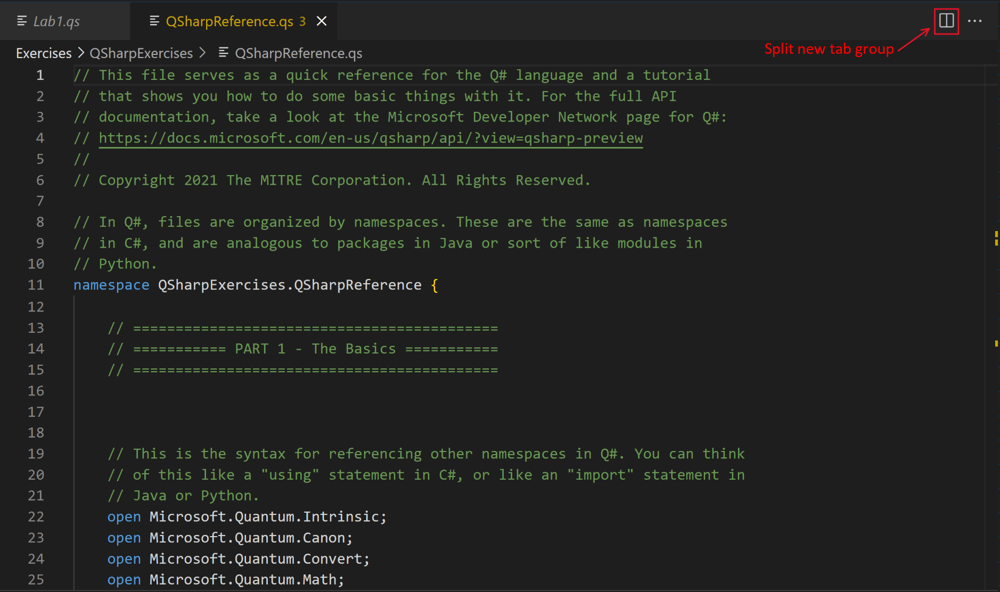
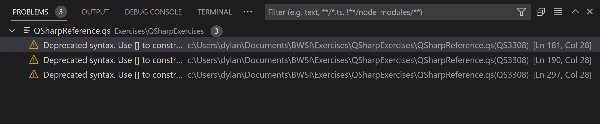
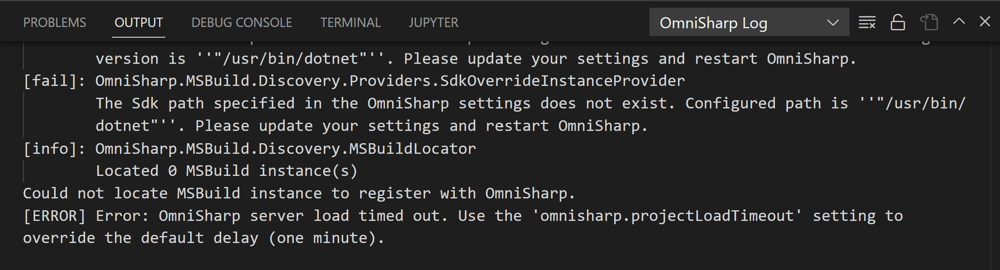

# Visual Studio Code

## Objective

Set up and practice working in the Visual Studio Code development environment.

???+ note
    If you haven't ever worked with Visual Studio Code and .NET before, we recommend working through the [Additional Materials](#additional-materials) section first to learn how to create a C# project. Then come back to the top of the page.

## The Visual Studio Code IDE

In this class, we're going to write lots of quantum code in a special language called Q#, allong with classical code in C#. You have the option to use the Visual Studio Code IDE. VS Code is a great tool for software development because it can be used as a beautiful developing environment for many languages such as Java, C/C++/C#, Python, HTML/CSS, etc. Developers using these languages make use of the large extension library that VS Code offers. The extensions add functionality to the IDE by providing GUI features like a file explorer, 'Run & Debug' buttons for command-line programs, project creation tools, unit testing options, and most importantly additional commands for the VS Code 'Command Pallete' accessible by View > Command Pallete (Ctr+Shift+P). 

Below is an image of what VS Code looks like. Labeled in red are the features we will be using most.
{: .center loading=lazy }

### The File Explorer

This is how you will move between files and folders in the IDE. Once you have opened the folder you will be working in, you should see something like this; all of your files in the folder organized in a tree structure.

{: style="height:662px;width:325px": .center loading=lazy }

To create a new Q# project folder with sufficient project files, you should select View > Command Palette (or Ctr+Shift+P) and type in 'Q#:' and 'Q#: Create new project...' should be there. Click this, and select 'Standalone console application'. Once prompted, you can open the new folder created by vs code and start working on your Program.qs! It automatically writes a Hello World program in qsharp, you can check everything is working by compiling and running the code using `dotnet run`. You can also just build the project without running it using `dotnet build`.

### The Extension Browser

The extension browser is how you will install extensions on Visual Studio Code. You should have installed at least:
 - Microsoft's Quantum Development Kit
 - Microsoft's C# extension
 - Jun Han's .NET Core Test Explorer extension 


### Test Explorer

The test explorer extension allows you to view a list of all of the unit tests found on the current workspace. It also provides support for running the tests using the play button at the top.

{: style="height:554px;width:364px": .center loading=lazy }

However, it seems the extension has a bug that does not allow running individual tests, only running all tests at once works properly. To do this, you will need to use the command line, the same way you need to use the command line to run your code. Supposing the name of the unit test you want to run is 'AllocateQubit', you can run this specific test by using the command in your terminal while in the directory that has the tests

`dotnet test --filter Name=AllocateQubit`

The output, if done correctly, should look something like this, where you can see the example test has passed:

{: .center loading=lazy }


### The Code Editor

The code editor is the area where you can view and edit source code files.
Here's a zoomed-in look:

{: .center loading=lazy }

As you can see, it comes with syntax highlighting, line numbers, and a preview of the entire active file's contents in place of a vertical scroll bar.

You can open multiple files in the code editor.
Each file will have its own **editor tab**, as shown in the top of this picture.
Clicking on a tab will open the editor for that file.

If you want to have two editors open simultaneously, you can create a **new tab group** split horizontally by clicking the split tab button on the top right of the editor. To split it vertically you must hold Ctrl+Alt and clicking it.  


Now, you'll see two editors appear side-by-side.
This can be helpful if you want to refer to one document while editing another.

Hovering over a variable in the code editor will bring up a tool tip that shows its documentation.
For example, hovering over the H function shows this:

{: .center loading=lazy }

This can be handy for a quick reference lookup.


### The Error List, Output, and Terminal

To open a terminal, go to the top of the window, select Terminal > New Terminal. One should open on the bottom. 

The bottom of the screen now contains some tabs: one is called **Problems**, another called **Output**, another called **Terminal**. You might have another, but we will not use it. 

The Problems pane shows syntax or compilation warnings and errors that your program has.
Some errors will appear as you type, others won't show up until you try compiling your code. It looks like this:

{: .center loading=lazy }

The Output pane shows debug messages from the compiler (and some other sources, but that's all we'll really use it for in this class).
It can help you figure out what went wrong if something breaks during compilation but the error messages aren't explicit enough.
It looks like this:

{: .center loading=lazy }

In this example, the OmniSharp Log is showing output. This is the language interpreter which provides some of the features for syntax coloring and formatting. To change it to view other output screens such as the .NET compiler, simply click the dropdown on the top right of the output window and select the desired source.

The Terminal pane is what you will use most. This is how you enter the dotnet commands to run, build, and test your code. Depending on your install and operating system, this terminal window may be different. 

If you have installed VS Code on windows without docker or WSL, it should be a Powershell or command prompt terminal. You can (but shouldn't need to) switch between these in the terminal settings, found on the bottom left (the gear icon).

If you have installed VS Code on mac without docker or WSL, the shell will be your MacOS terminal, a zsh interpreter. You can change this to bash whenever you want simply by typing `bash`, if you prefer bash.

If you have installed VS Code and plan on using the WSL extension to run your code using a Linux subsystem, or if you have installed VS Code and plan on running it in a docker container, your shell will be a bash Ubuntu Linux terminal. 

Within the scope of this course, all should be equivalent with the dotnet commands.

## Running the ConsoleSandbox Program

The class solution contains a console / terminal program called `ConsoleSandbox`, which is essentially a playground you can use when learning Q# to experiment and play with things.
To run it, simply run `dotnet run` in this directory. This will launch a new terminal window and automatically start the program.

## Additional Materials

### Project Setup

- [Visual Studio Code download page](https://code.visualstudio.com/download)

- [Using dotNET with VS Code](https://code.visualstudio.com/docs/languages/dotnet)

- [dotNET tutorial on setting up a C# project](https://youtu.be/R5CHKcXuRtY)

- [Unit testing C# with dotNET](https://docs.microsoft.com/en-us/dotnet/core/testing/unit-testing-with-dotnet-test)

- [Running selective unit tests with xUnit](https://docs.microsoft.com/en-us/dotnet/core/testing/selective-unit-tests?pivots=xunit#xunit)

- [Microsoft doc page on unit test basics](https://docs.microsoft.com/en-us/visualstudio/test/unit-test-basics?view=vs-2019)

- [Walkthrough to create and run unit tests](https://docs.microsoft.com/en-us/visualstudio/test/walkthrough-creating-and-running-unit-tests-for-managed-code?view=vs-2019)

- [Q# instructions for testing and debugging](https://docs.microsoft.com/en-us/azure/quantum/user-guide/testing-debugging?tabs=tabid-vscode)

### C# Basics

- [Microsoft programming guide on arrays](https://docs.microsoft.com/en-us/dotnet/csharp/programming-guide/arrays/)

- [Microsoft programming guide on passing value-type parameters](https://docs.microsoft.com/en-us/dotnet/csharp/programming-guide/classes-and-structs/passing-value-type-parameters)

- [Microsoft programming guide on passing reference-type parameters](https://docs.microsoft.com/en-us/dotnet/csharp/programming-guide/classes-and-structs/passing-reference-type-parameters)

## Knowledge Check

### Q1

What does IDE stand for?

??? check "Answer"
    Integrated Development Environment

### Q2

Which of the following is an advantage of using an IDE? (Check all that apply.)

A: All the tools needed to develop software are integrated into one application

B: An IDE typically sports a powerful graphical user interface that can make for a more friendly development experience

C: There is always a one-to-one relationship between the project files as they are displayed in the IDE and the files in the project folder in the underlying filesystem, with nothing hidden from the user

D: Many IDEs check your code as you type, similar to spell check in a word processor, to help prevent common mistakes

E: All IDEs work with any language or framework; it’s a matter of developer preference on which one to use for a particular application

??? check "Answer"
    A, B, D

### Q3

Which of the following is an advantage of writing unit tests? (Check all that apply.)

A: If a component has unit tests, it is guaranteed to be bug-free

B: Test driven development can help to ensure software requirements are being met

C: A comprehensive library of unit tests can help identify problems when they occur and debug them quickly

D: Even in complex software projects, unit tests can check for the correct behavior in every possible state of the system

E: Writing unit tests encourages a modular approach to software development where the outputs and/or behavior of each component are clearly defined

??? check "Answer"
    B, C, E

### Q4

Fill in the `Exponent` function below so that it passes the `ExponentTest` unit test. Assume the appropriate scaffolding is put in place. Use the least number of characters possible.

```c# linenums="1"
public int Exponent(int a, int b)
{
    // ???
}

...

[TestMethod]
public void ExponentTest()
{
    Assert.AreEqual(Exponent(3, 2), 9);
}
```

??? check "Answer"
    `return 9;`

## Exercises

Open the course exercises in Visual Studio Code. Select the `CSharpExercises` project and build it. Open the Test Explorer and run all the unit tests in the project. (The project should build, but the tests should fail. In the Solution Explorer, open `CSharpExercises\Exercises.cs`. There are eight functions that need to be implemented to pass the unit tests. Only modify the code inside each function, and do not modify `Tests.cs`.

The solutions to the exercises are available on GitLab.
